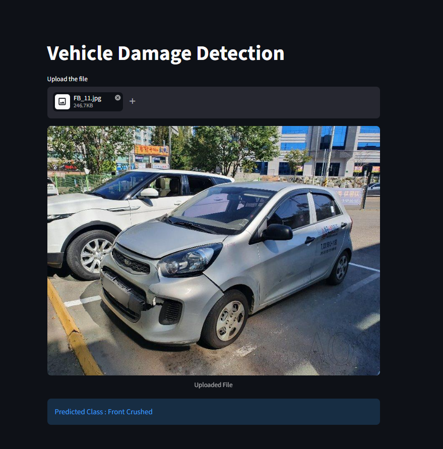

# Vehicle Damage Detection App

This app lets you upload an image of a car and it will tell you 
what kind of damage it has. The model is trained on front and 
rear view images of cars hence the picture should capture the 
front or rear view of a car.



### Model Details
1. Used ResNet50 for transfer learning
2. Model was trained on around 2300 images with 6 target classes
   - Front Normal
   - Front Crushed
   - Front Breakage
   - Rear Normal
   - Rear Crushed
   - Rear Breakage
3. The accuracy on the validation set was around 82%

### Set Up

1. To get started, first install the dependencies using:
```commandline
   pip install -r requirements.txt
```

2. Run the streamlit app:
```commandline
   streamlit run app.py
```